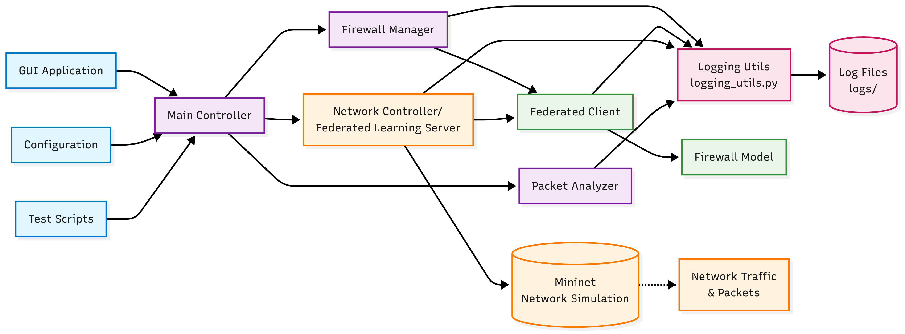

# Federated Firewall

Federated Firewall is a network security monitoring and control tool designed for experimental environments (e.g., **Mininet**). It provides a **graphical dashboard** (`gui_app.py`) that runs alongside the backend (`src/main_simple.py`) and parses logs in real time for enhanced system visibility.

---

## 🏗️ System Architecture
<p align="center">
  
</p>

---

## 🚀 Features
- Real-time GUI dashboard for firewall phases (Learning / Testing).
- Federated system control and monitoring.
- Mininet-compatible with **Open vSwitch Test Controller**.
- Log parsing with `--debug` and `--log-level DEBUG`.
- Virtual environment support with `requirements.txt`.

---

## 📂 Project Structure
```bash
Federated_firewall/
    ├── config/
    │   └── simple_config.yaml
    ├── logs/
    ├── scripts/
    │   └── quick_test.py
    ├── src/
    │   ├── core/
    │   │   ├── firewall_manager.py
    │   │   └── simple_packet_analyzer.py
    │   ├── federated/
    │   │   └── simple_client.py
    │   ├── mininet_controller/
    │   │   └── simple_network.py
    │   ├── models/
    │   │   └── simple_firewall.py
    │   ├── utils/
    │   │   └── logging_utils.py
    │   └── main_simple.py
    └── gui_app.py
```

---

## ⚙️ Prerequisites
Before running the project, ensure:
1. **Python 3.8+** is installed.
2. **Virtual environment (`venv`)** is available.
3. **Mininet** is installed.
4. **Open vSwitch Test Controller** is installed and linked:
   ```bash
   sudo apt-get install openvswitch-testcontroller
   sudo ln /usr/bin/ovs-testcontroller /usr/bin/controller
   ```

---

## 🔧 Setup Instructions

### 1. Clone the Repository
```bash
git clone https://github.com/VariableString/Federated_Firewall.git
cd Federated_Firewall
```

### 2. Create and Activate Virtual Environment
```bash
python3 -m venv venv
source venv/bin/activate   # On Linux/macOS
venv\Scripts\activate      # On Windows
```

### 3. Install Dependencies
```bash
pip install --upgrade pip
pip install -r requirements.txt
```

---

## ▶️ Running the Project

### Backend (CLI Mode)
```bash
sudo env "PATH=$PATH" python3 src/main_simple.py --debug --log-level DEBUG
```

### GUI Mode (Recommended)
```bash
sudo env "PATH=$PATH" python3 gui_app.py
```

This will launch the **Federated Firewall Dashboard**, which updates live from system logs.

---

## 🛑 Stopping the Project
- Press **Ctrl+C** in the terminal running the process.
- The GUI will flush and stop gracefully (system logs remain intact).

---

## 📌 Notes
- This project is recommended for Linux OS environments.
- Always use **`sudo env "PATH=$PATH"`** when launching to ensure the system PATH is preserved.
- For Mininet users, the firewall integrates with OVS for network simulation.
- Use CPU version for PyTorch for better performance.

---

## 📜 License
This project is licensed under the **MIT License**. See `LICENSE` file for details.
